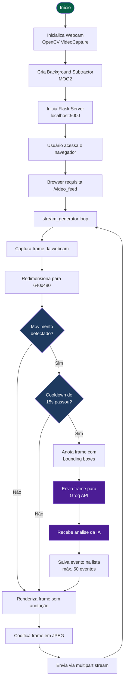
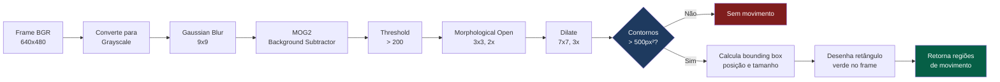
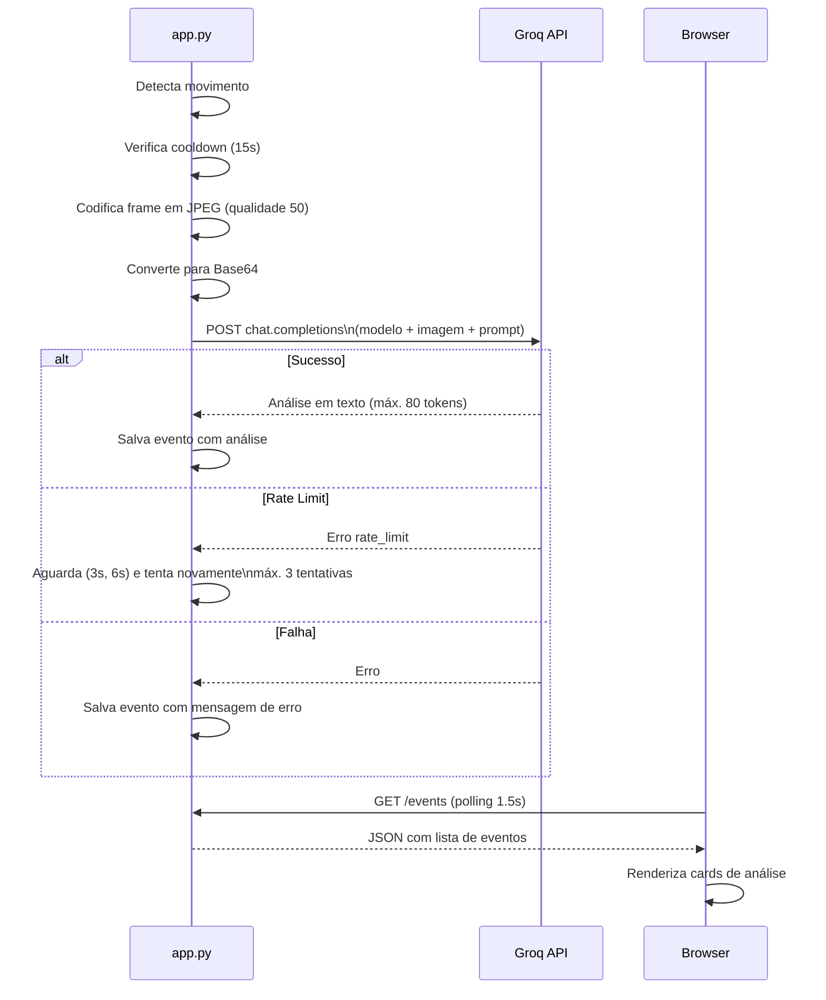

# Estrutura do Projeto — iaCAM

Documentação técnica da arquitetura e fluxo de funcionamento do **iaCAM**, um sistema de vigilância inteligente que combina detecção de movimento em tempo real com análise de cena por inteligência artificial.

---

## Visão Geral

```
┌─────────────────────────────────────────────────────────────┐
│                          iaCAM                              │
│                                                             │
│   Webcam  ──►  OpenCV  ──►  Flask  ──►  Browser             │
│                   │                                         │
│                   └──► Groq API (Llama 4 Vision)            │
└─────────────────────────────────────────────────────────────┘
```

O sistema captura vídeo da webcam, processa cada frame localmente para detectar movimento e, ao identificar uma movimentação relevante, envia o frame para a IA na nuvem (Groq) que descreve o que está acontecendo. Tudo é exibido em tempo real no navegador.

---

## Arquitetura de Componentes

```
┌──────────────────────────────────────────────────────────────────┐
│                         app.py (Flask)                           │
│                                                                  │
│  ┌─────────────────────────────────────────────────────────┐     │
│  │                   MotionDetector                        │     │
│  │                                                         │     │
│  │   ┌─────────────┐    ┌──────────────┐    ┌──────────┐   │     │
│  │   │ VideoCapture│───►│detect_motion │───►│query_groq│   │     │
│  │   │  (OpenCV)   │    │   (MOG2)     │    │  (API)   │   │     │
│  │   └─────────────┘    └──────────────┘    └──────────┘   │     │
│  │          │                  │                  │        │     │
│  │          ▼                  ▼                  ▼        │     │
│  │   Frame bruto         Frame anotado       Análise IA    │     │
│  │                                                         │     │
│  │   stream_generator() ◄──────────────────────────────    │     │
│  └─────────────────────────────────────────────────────────┘     │
│                                                                  │
│  Rotas:  /  │  /video_feed  │  /events  │  /groq-status          │
└──────────────────────────────────────────────────────────────────┘
                              │
                              ▼
                    ┌──────────────────┐
                    │  templates/      │
                    │  index.html      │
                    │  (Frontend)      │
                    └──────────────────┘
```

---

## Fluxo Principal



---

## Pipeline de Detecção de Movimento



### Classificação das Regiões Detectadas

```
Frame 640x480 dividido em zonas:

  ┌──────────┬──────────┬──────────┐
  │ superior │ superior │ superior │
  │ esquerda │  centro  │  direita │
  ├──────────┼──────────┼──────────┤  ◄── y=160
  │   meio   │   meio   │   meio   │
  │ esquerda │  centro  │  direita │
  ├──────────┼──────────┼──────────┤  ◄── y=320
  │ inferior │ inferior │ inferior │
  │ esquerda │  centro  │  direita │
  └──────────┴──────────┴──────────┘
       ▲            ▲           ▲
     x=213        x=427

  Tamanho:
    pequeno  →  área < 10.000 px²
    médio    →  área entre 10.000 e 50.000 px²
    grande   →  área > 50.000 px²
```

---

## Integração com a Groq API



---

## Rotas da API

| Rota | Método | Descrição |
|---|---|---|
| `/` | GET | Serve o frontend (`index.html`) |
| `/video_feed` | GET | Stream MJPEG da câmera em tempo real |
| `/events` | GET | JSON com os últimos 50 eventos detectados |
| `/groq-status` | GET | Status da conexão com a Groq API e modelo ativo |

### Exemplo de resposta `/events`

```json
[
  {
    "count": 3,
    "timestamp": "14:32:07",
    "analysis": "Uma pessoa acena com a mão direita em direção à câmera. O gesto parece ser um cumprimento."
  },
  {
    "count": 2,
    "timestamp": "14:30:51",
    "analysis": "Movimento de braço detectado no lado esquerdo do frame. A pessoa está gesticulando."
  }
]
```

---

## Frontend — Atualização em Tempo Real

```
Browser
  │
  ├──   ──────────────────► Stream MJPEG contínuo
  │                                                 (multipart/x-mixed-replace)
  │
  └── setInterval(updateEvents, 1500ms)  ─────────► GET /events
                                                     Renderiza cards de análise
```

O vídeo é exibido via **MJPEG streaming** (sem WebSocket), onde o servidor envia frames JPEG continuamente. Os eventos de IA são atualizados via **polling** a cada 1,5 segundos.

---

## Estrutura de Arquivos

```
iaCAM/
├── app.py              # Servidor Flask + lógica de detecção e IA
├── templates/
│   └── index.html      # Interface web (HTML + CSS + JS vanilla)
├── requirements.txt    # Dependências Python
├── .env                # Chave da API Groq (não versionado)
├── .env.example        # Modelo do .env
├── .gitignore
├── README.md
└── ESTRUTURA.md        # Este arquivo
```

---

## Decisões de Design

**Cooldown de 15 segundos** — evita spam de requisições à API ao detectar movimento contínuo, mantendo o custo de uso da Groq sob controle.

**Qualidade JPEG 50%** — reduz o tamanho do payload enviado à API sem comprometer a capacidade da IA de identificar gestos e ações.

**MOG2 com grayscale** — a subtração de fundo opera em escala de cinza para melhor performance, já que cor não é relevante para detectar movimento.

**RLock no acesso à lista de eventos** — garante thread safety entre o loop de captura (que escreve eventos) e as requisições HTTP (que leem eventos).

**Máximo de 50 eventos em memória** — mantém o consumo de RAM previsível em sessões longas.
